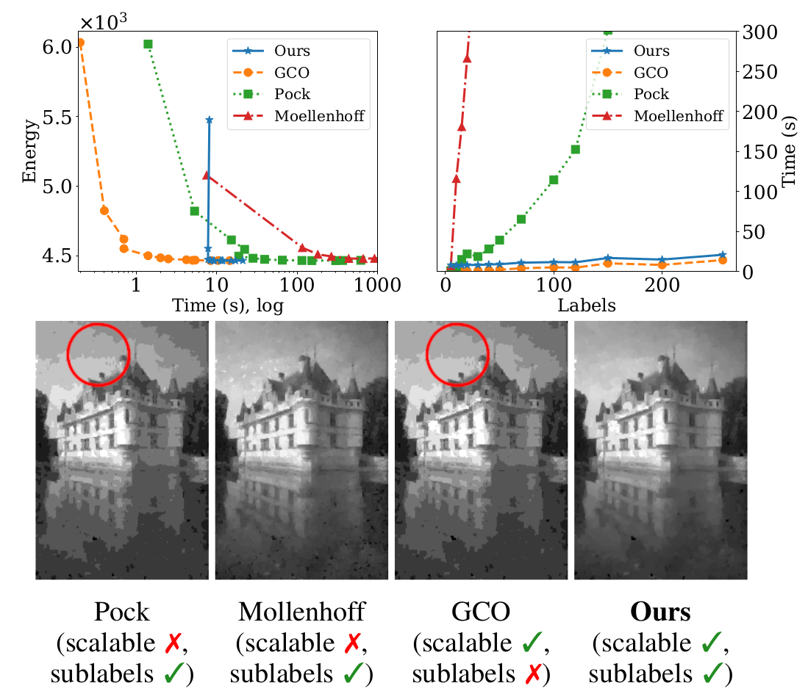

# Efficient and Flexible Sublabel-accurate Energy Minimization

We address the problem of minimizing a class of energy functions consisting of data and smoothness terms that commonly occur in machine learning, computer vision, and pattern recognition. While discrete optimization methods are able to give theoretical optimality guarantees, they can only handle a finite number of labels and therefore suffer from label discretization bias. Existing continuous optimization methods can find sublabel-accurate solutions, but they are not efficient for large label spaces. In this work, we propose an efficient sublabel-accurate method that utilizes the best properties of both continuous and discrete models. We separate the problem into two sequential steps: (i) global discrete optimization for selecting the label range, and (ii) efficient continuous sublabel-accurate local refinement of a convex approximation of the energy function in the chosen range. Doing so allows us to achieve a boost in time and memory efficiency while practically keeping the accuracy at the same level as continuous convex relaxation methods, and in addition, providing theoretical optimality guarantees at the level of discrete methods. 
Finally, we show the flexibility of the proposed approach to general pairwise smoothness terms, so that it is applicable to a wide range of regularizations. Experiments on the illustrating example of the image denoising problem demonstrate the properties of the proposed method. 


In both of the top plots each point for a method represents a fixed number of labels 5, 10, ..., 256. Continuous optimization methods by Pock et al. and Moellenhoff et al. solve the problems of choosing the optimal label range and sublabel-accurate refinement simultaneously, which makes them poorly scalable to large label spaces (see top right plot). In contrast, we propose to solve the two problems sequentially, which significantly reduces the computational costs producing almost optimal results much faster than previous continuous methods (see top left plot in logarithmic time). The discrete initialization of our method (GCO) scales best w.r.t. number of labels, but suffers from label discretization bias. Our sublabel-accurate refinement substantially reduces label discretisation artefacts (see images on the bottom for the case of |L|=10 labels), takes constant time w.r.t. label space discretization, and requires fewer number of labels than discrete method to reach plausible results.

## Usage  

### Quick Try Out
```
git clone --recurse-submodules https://github.com/nurlanov-zh/sublabel-accurate-alpha-expansion.git
```

* Install and compile all third-parties in `third-party` folder.

* Run Matlab (tested on `Matlab R2015-b`), consider using `run_matlab.sh` command if you want to try out previous methods with GPU usage.

* Add paths by `startup.m` and find image denoising example in `image_denoising.m`.
  

#### Non-submodular energies
If you would like to use GCO with non-submodular energies, consider replacing `addterm2_checked` function in `third-party/gco-v3.0/GCoptimization.cpp` to:

```
OLGA_INLINE void GCoptimization::addterm2_checked(EnergyT* e, VarID i, VarID j, 
       EnergyTermType e00, EnergyTermType e01, EnergyTermType e10, EnergyTermType e11, EnergyTermType w)
{
       if ( e00 > GCO_MAX_ENERGYTERM || e11 > GCO_MAX_ENERGYTERM || e01 > GCO_MAX_ENERGYTERM || e10 > GCO_MAX_ENERGYTERM )
               handleError("Smooth cost term was larger than GCO_MAX_ENERGYTERM; danger of integer overflow.");
       if ( w > GCO_MAX_ENERGYTERM )
               handleError("Smoothness weight was larger than GCO_MAX_ENERGYTERM; danger of integer overflow.");
       // Inside energy/maxflow code the submodularity check is performed as an assertion,
       // but is optimized out. We check it in release builds as well.
       if ( e00+e11 > e01+e10 ) {
               // printf("i = %d, j = %d\ne00 = %d, e11 = %d, e01 = %d, e10 = %d, e00+e11 = %d, e01+e10 = %d, e00+e11-(e01+e10) = %d, but must be <= 1\n",
               //      i, j,e00, e11, e01, e10, e00+e11, e01+e10, e00+e11-(e01+e10));
               
               if ( e00+e11-(e01+e10) <= 1 ) { // discretisation error, only give a message
                       // printf("Minor violation of non-submodular expansion term detected (discretisation error); ignoring...\n");
               }
               else {
                       // handleError("Non-submodular expansion term detected; smooth costs must be a metric for expansion");  
               }
       }

       // if ( e00+e11 > e01+e10 )
       //      handleError("Non-submodular expansion term detected; smooth costs must be a metric for expansion");
       m_beforeExpansionEnergy += e11*w;
       e->add_term2(i,j,e00*w,e01*w,e10*w,e11*w);
}
```


#### (Optinally, requires external solver) Sublabel-accurate refinement:
- If you want to reproduce the same timings, consider adding external 
solvers (Gurobi). Add their paths into Matlab by editing `startup.m`.

- Run the test file `third-party/yalmip/yalmiptest.m` from Matlab to check 
if the external solvers are found.

#### (Optionally, requires GPU) Previous sublabel-accurate methods: 
```sh
cd third-party/prost/
mkdir build
cd build
cmake .. 
make -j 4 
  
cd ../../sublabel_relax/cvpr2016/ 
mex compute_convex_conjugate.cpp
``` 

To run previous sublabel-accurate methods consider starting MatlabR2015-b 
via the following command:
```sh
LD_PRELOAD="/usr/lib/x86_64-linux-gnu/libstdc++.so.6" matlab
```
or by running bash script `run_matlab.sh`.
  
  
## References 

**Important**: Please be aware of the Licences and Copyrights of the used third-party software. Check Readme and/or Licence files in corresponding `third-party` folders. 


Code is based on the following third-parties:

- [GCO-v3.0](https://github.com/nsubtil/gco-v3.0)
- [prost](https://github.com/tum-vision/prost)
- [sublabel-relax](https://github.com/tum-vision/sublabel_relax)
- [yalmip](https://yalmip.github.io/)
- [multilabel_submodular](https://github.com/shaibagon/multilabel_submodular)

And on the following publications:

[1] D. Schlesinger and B. Flach, ["Transforming an arbitrary MinSum problem into a binary one"](http://www1.inf.tu-dresden.de/~ds24/publications/tr_kto2.pdf), Technical report TUD-FI06-01, Dresden University of Technology, April 2006.
       
[2] Yuri Boykov and Vladimir Kolmogorov, "An Experimental Comparison of Min-Cut/Max-Flow Algorithms for Energy Minimization in Computer Vision", TPAMI, September 2004. 
 
[3] Vladimir Kolmogorov and Ramin Zabih, "What Energy Functions can be Minimized via Graph Cuts?", TPAMI, February 2004. 
         
[3] Shai Bagon "Matlab Implementation of Schlezinger and Flach Submodular Optimization", June 2012.

[4] Yuri Boykov, Olga Veksler, and Ramin Zabih, ["Fast approximate energy minimization via graph cuts"](http://www.cs.cornell.edu/rdz/Papers/BVZ-iccv99.pdf), TPAMI, November 2001.

[5] Thomas Mollenhoff, Emanuel Laude, Michael Moeller, Jan Lellmann, and Daniel Cremers, ["Sublabel-accurate relaxation of nonconvex energies"](https://arxiv.org/pdf/1512.01383.pdf), CVPR, 2016.

[6] Thomas Pock, Daniel Cremers, Horst Bischof, and Antonin Chambolle, "Global solutions of variational models with convex regularization", SIAM Journal on Imaging Sciences, 2010.

* See full list of references in our paper
